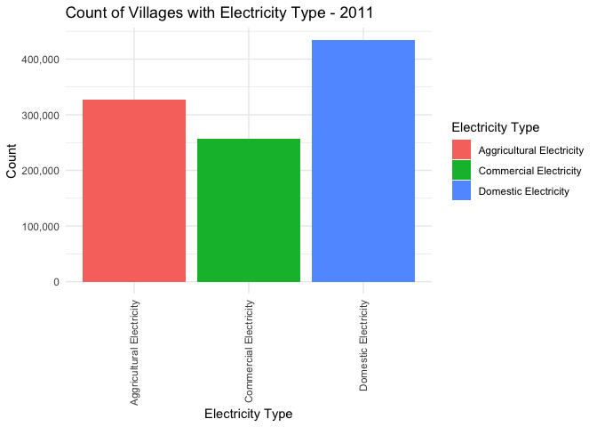
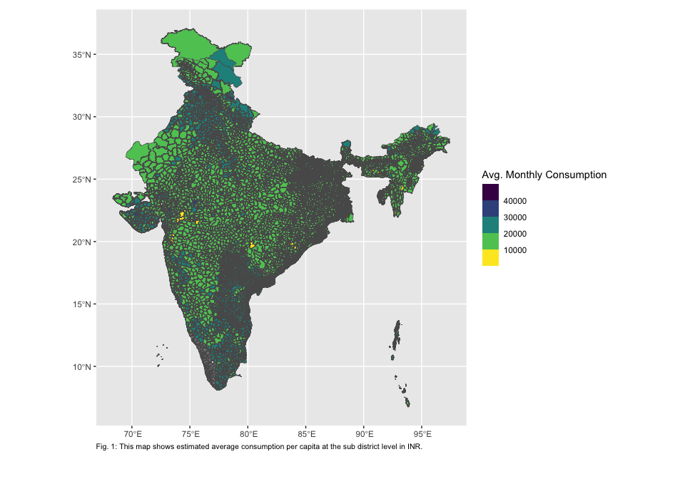
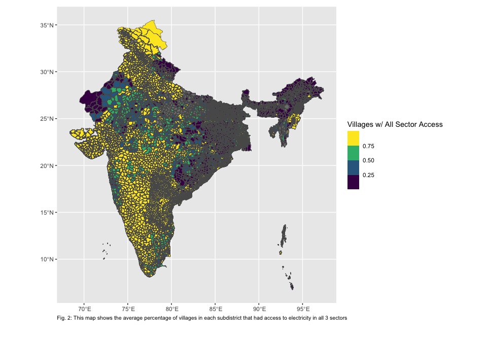

\usepackage{dcolumn}

\usepackage{booktabs}

## Abstract

This study examines the effects of village-level electrification on
socioeconomic welfare in rural India, with a focus on inequities in
access and outcomes. Electrification is widely regarded as a catalyst
for development, improving productivity, educational attainment, and
income. However, the distribution of these benefits remains uneven.
Using cross-sectional data from the Socioeconomic High Resolution Urban
Geographic (SHRUG) dataset, this paper investigates the relationship
between eelctricity access and estimated monthly consumption per capita,
a proxy for welfare.

The analysis employs multiple linear regression to control for factors
such as income, poverty rates, gender composition, and land ownership.
Results indicate that access to domestic electricity increases estimated
monthly consumption by 1.6%, highlighting its positive impact on
welfare. However, access to commercial electricity shows no significant
effect, underscoring the limited role of electrification in
non-agricultural sectors. The findings reveal that higher-income
villages are more likely to benefit from electrification, exacerbating
existing socioeconomic inequities.

This study contributes to the growing body of literature by offering
village-level insights into the determinants and consequences of
electrification. Policymakers must address distributional disparities
and prioritize targeted strategies-such as integrating gender
empowerment and poverty alleviation programs- to ensure equitable access
and masximize the developmental benefits of rural electrification.



## Introduction

Access to electricity is widely recognized as a cornerstone of
socioeconomic development. Electrification enhances productivity,
improves education outcomes, and increases income, making it a critical
tool for poverty reduction in developing countries. Despite significant
global progress, nearly one billion people still lack access to
electricity, with rural areas in developing nations experiencing the
greatest inequities (Burlig and Preonas 2024). India provides a
compelling case for examining the impacts of rural electrification:
Between 2000 and 2016, India contributed to 80% of global gains in
household grid connections, underscoring its efforts to expand energy
infrastructure to underserved areas.

However, the benefits of electrification are not distributed evenly.
Existing research revals discrepancies in welfare outcomes based on
population size, socioeconomic status, and local conditions. For
instance, Burlig and Preonas (2024) find that smaller villages often
experience limited or even negative welfare impacts from
electrification, while larger villages see significant gains. Similarly,
Khandker et al. (2012) show that higher-income households benefit more
from electrification, as they are better positioned to leverage new
energy resources for productivity and consumption. These findings raise
important questions about the determinants of electrification and its
role in addressing socioeconomic inequities at the village level.

This study seeks to explore two central questions: 1) What are the
determinants of access to electrification for rural villages in India?
2) To what extent does electrification improve welfare, as measured by
estimated monthly consumption per capita?

Using the Socioeconomic High Resolution Urban Geographic (SHRUG)
dataset, this paper conducts a cross-sectional analysis at the village
level to examine the relationship between electrification and welfare.
While much of the existing research focuses on household-level impacts
using datasets like the IHDS, this study offers a unique perspective by
using data aggregated at the village level. The results aim to provide
insights into the inequities of access and inform targeted policy
interventions for inclusive development.

The paper proceeds as follows: Section 2 reviews relevant literature,
highlighting findings on the impacts of electrification and factors
influencing its distribution. Section 3 outlines the theoretical
framework and hypothesis. Section 4 describes the methodology, including
the data and regression model used. Section 5 presents the results, and
section 6 discusses their implications. Finally, section 7 concludes
with policy recommendations and directions for future research.

## Literature Review

Electrification is widely regarded as a driver of economic development.
Several studies demonstrate its positive effects on education, labor
markets, and income. Khandker et al. (2012) finds that electrification
increases weekly study time for children by 1 hour, boosts women’s
employment hours by 17%, and raises per capita income by 38.6%. This
highlights how electricity can alleviate household labor, particularly
for women, freeing up time for income-generating activities.

Rathi and Vermaak (2018) provide evidence that electrification improves
rural labor market outcomes with a gendered lens: women’s labor
participation increases due to reduced time spent on fuel collection and
domestic chores, while men’s participation shows slight declines.

Burlig and Preonas (2024) find that smaller villages experience negative
welfare effects after gaining electricity access, in contrast to larger
villages where welfare nearly triples. This raises questions about the
scalability and equity of eledctrification programs in India. Sedai et
al. (2021) emphasizes that marginalized communities derive fewer
benefits from electrification compared to dominant groups, underscoring
how social structures influence outcomes.

In Khandker et al. (2012) researchers argue that the impact of
electrification across income and expenditure vary with higher income
households receiving more benefits from electrification. In their study
Khandker et al. (2012) say that it can be argued income and expenditure
don’t depend on proportion of households with electricity, rather, it
depends on household size and age composition of the household.

In Sedai et al. (2021) researchers examine the probability of
electrification and the effect of electrification for marginalized
communities compared to dominant communities using the IHDS II data set.
They find that marginalized communities benefit less from
electrification than dominant communities.

Researchers in Rathi and Vermaak (2018) examine the impacts of rural
electrification on labor market outcomes through a gendered lens. The
study finds that on average when rural Indian communities receive access
to electricity, women are more likely to work at least 240 hours, and
men are less likely to work. The study argues this is because access to
electricity frees up time by reducing time spent collecting fuel and
making household tasks more efficient. In Rathi and Vermaak (2018)
argues the extent that electrification improves the labor force depends
on supporting policies, labor absorption capacity and willingness to
participate in income generating activities which may be related to
local norms. The Rathi and Vermaak (2018) study concludes that policy
makers should consider local social and political structures, gender
roles, and labor absorptive capacity to realize benefits of rural
electrification programs. Singh (2016) and Auerbach (2019) provide
evidence showing that social, cultural and political structures have
important effects on development.

## Theory and Hypothesis

Examining how electricity access shapes the overall economic landscape
of impoverished villages is highly relevant for developing countries
seeking to expand their energy infrastructure and improve living
standards. India presents an instructive setting to investigate
questions related to economic outcomes.

In 1947, 1500 villages in India had access to electricity. India
contributed to 80% of global gains in new household grid connections
between 2000 and 2016 (Burlig and Preonas 2024). Since 1951 India has
implemented at least ten major initiatives aimed at increasing
electrification (Rathi and Vermaak 2018). Among the most notable include
the Rajiv Gandhi Grameen Vidyutikaran Yojna (RGGVY) from 2005-2011,
which had a target of achieving 100 percent rural electrification, and
the Deen Dayal Upadhyaya Gram Jyoti Yojana (DDUGJY) which succeeded the
RGGVY program and is focused on providing more consistent power supply
to rural areas of India.

Existing research, such as Thomas et al. (2020), suggests a positive
association between electrification and total household expenditure
using the latter as a proxy for disposable income. This paper attempts
to examine this effect.

This study contributes to the literature by examining these
relationships at the village level. Using the Socioeconomic
High-resolution Rural-Urban Geographic (SHRUG) dataset which includes
data from the 2011 Indian population census and the Socio-Economic and
Caste Census (SECC), the study adopts a cross sectional analysis that
focuses on village level variation in electrification and socioeconomic
indicators. This approach allows the paper to capture how initial
conditions such as education levels, land assets, and housing quality
may shape the likelihood of electrification and the magnitude of its
economic benefits.

Based on the existing literature, this paper derives to hypothesis:

Hypothesis 1: Villages that have access to electricity will exhibit
higher average per capita consumption levels than villages without
access. This reflects the expected productivity gains, increased labor
market participation, and reduced opportunity costs associated with
traditional fuel use.

Hypothesis 2: Villages with relatively stronger socioeconomic
foundations such as higher levels of education, better housing
conditions, and greater land assets will be both more likely to have
access to electricity and more effectively translate that access into
higher consumption levels. The initial socioeconomic environment
influences the probability of electrification and the extent of its
positive impact.

## Methodology

This study employs a cross-sectional analysis to investigate the
relationship between village-level electrification and welfare outcomes,
measured by estimated monthly consumption per capita. The analysis
utilizes data from the SHRUG dataset. The SHRUG dataset aggregates
household level data into village level metrics, providing a robust
framework for analyzing socioeconomic outcomes at the village scale.

The unit of analysis for this study is the village, aggregated from
household level data. This approach allows for identification of
collective welfare impacts of electrification, complementing prior
household level studies. Village level analysis is particularly relevant
for policy formulation, as rural electrification programs are often
implemented at this scale.

Using a multiple linear regression we are able to simulate a ceterus
peribus effect, holding other factors fixed. By controlling for factors
such as the proportion of the household that had an income of at least
5,000 Rs, hours of electricity the village has in the summer, rate of
poverty in the village, proportion of the population that is female,
proportion of the population that is female and in poverty, proportion
of people in the village that own land, the analysis controls for
factors that may affect consumption.

The various types of electricity access signify if a village had access
to electricity for that sector. According to 2011 population census
documentation, if 10% of households were electrified, the variable for
domestic access to electricity was coded as a 1. If the village had
access to electricity for agriculture, the electricity for agriculture
variable was coded as a 1. If the village had access to electricity for
commercial purposes, the variable for commercial electricity was coded
as a 1. The SECC records earnings for the highest earning member of the
household in three bins, 0 to 4,999 rupees, 5,000 to 9,999 rupees, and
10,000 or more rupees. According to Asher and Novosad (2019) 85% of
households report being in the lowest bin. This analysis used the 5,000
to 9,999 rupee bin to estimate the impact for lowest and highest
earners.

## Data

Shrug is an open source repository of Indian village-level datasets
Asher et al. (2021) . The data set includes population census data from
2001 and 2011, and Socioeconomic and Caste Census (SECC) data from 2011.
Researchers Asher et al. (2021) create a measure of estimated
consumption per capita and estimated poverty level. To create the
variables Asher et al. (2021) use data from the Indian Human Development
Survey (IHDS-II) and combine it with data from the SECC. They regress
household consumption from the IHDS data set with SECC data that
includes household level enumeration of assets. The IHDS consumption
expenditures are based on 47 questions about household consumption. The
total average total expenditure per household is used as a measure of
each household’s economic level. They include variables for consumption
of food items such as rice, wheat, sugar and meat. The consumption
metric also includes average amount spent on fuel and kerosene. The
monthly consumption variable is based on household level consumption
aggregated up to the village level to construct estimated consumption
per capita and estimated poverty level.

Estimated consumption per capita is the outcome of interest for
exploring the welfare impacts of electrification. It can be assumed that
people who gain electricity will have better welfare outcomes and will
consume more. If consumption increases for villages that have
electricity, having electricity is a significant indicator for
development.

The Popoulation Census of India collects data about India’s population
on a decennial interval. In Vasudha Foundation (2013) it is estimated
that 34,887 villages are yet to be electrified. The population census
Census 2011 - concepts & definitions used in town and village amenities
(2023) includes dummy variables for whether there is access to
electricity for agriculture use, commercial use, and domestic use. If
10% of households in a village have electricity, it is coded as a 1
(Vasudha Foundation 2013 ). The data includes a dummy variable that
indicates if all 3 sectors have access to electricity.

In India the population census is collected by the Registrar General.
Enumerators are sent to visit every household across the country
(Government of India n.d.). Information about each individual is
gathered using a questionnaire and captures demographic information.

The SECC is conducted in the same way in a survey conducted by India’s
Ministry of Rural Development. The SECC aims to document the
socioeconomic status of all households in urban and rural areas. The
survey documents the material of the walls and roof individuals are
living in, demographic information, education level, disabilities, caste
status, and ownership of assets such as cell phones, motor vehicles, and
land.

The survey data used for this analysis was collected in 2011, at the end
of the RGGVY program. The program started its initiative towards 100%
electrification in 2004 and villages that were selected for
electrification in the first wave received funding between 2005 and 2008
(Burlig and Preonas 2024). Villages that were selected in the second
wave received funding between 2008 and 2011 (Burlig and Preonas 2024).

## Descriptive Statistics

Table 1 shows descriptive statistics for the covariates. There were 57%
of villages in rural areas in 2011 that had electricity for domestic,
agriculture, and commercial purposes, 90% of villages had electricity
for at least 10% of households.

According to the data, 210,286 villages do not have electricity access
for all three documented sectors, and 274,344 villages have electricity
for all three sectors.

The bar graph below shows the raw data for access to power for each
sector as they are coded for each village. Access to domestic
electricity is the highest with 90% of villages being coded as having
domestic electricity access, however it is unclear what percentage of
households in these villages have access to electricity.



The map below shows estimated average monthly consumption per capita for
sub districts in India that are classified as rural in the data set.
Yellow areas represent sub districts that have an estimated monthly
consumption of 10,000 INR or below, green is 20,000 or below, dark green
is 30,000 or below, blue is 40,000 or below, and purple is 40,000 or
more.



The map below shows a breakdown of sub districts by whether villages in
the sub district have access to power in all 3 sectors. Over 75% of
villages in sub districts that are yellow had all 3 types of power in
2011, a sub district that is green had between 50% and 75% of villages
that had all 3 types of electricity, a sub district that is blue has
between 25% and 50% of villages that had access to all types of
electricity, and a sub district that is purple had less than 25% of
villages that had access to all 3 kinds of electricity.

## Model

The model used to explore the welfare impacts of electrification is as
follows.

$(log)Y_i = \beta_0 + \ \beta_1AccesstoElectricity + \ \beta_2Income5k + \ \beta_3RateofPoverty + \ \beta_4ProportionofFemaleinVillage + \ \beta_3\beta_4RateofPovertyxProportionFemale + \ \beta_5OwnLand + \ u$

In this model $Y_i$ is the outcome of interest, log of estimated monthly
consumption. A log linear model also reduces the impacts of possible
heterogeneity. The main independent variable $\beta_1$ is access to
electricity. The covariate $\beta_2$ is share of households that the
income of the highest earning member is greater than 5k Rs. $\beta_3$ is
the estimated rate of poverty in the village. $\beta_4$ is proportion of
the population that is female, $\beta_3x\beta_4$ is an interaction term
between rate of poverty in the village and proportion that is female,
and $\beta_5$ is share of households that own land. The error term $u$
contains unexplained variance in the model.

## Results

When the primary independent variable is access to electricity in all
three sectors, consumption decreases by 2.6%. This result is shown in
Table 3. This is likely a result of the dummy variable for the
commercial sector. Since this data is based on the SECC census for rural
populations, commercial access to electricity is arguably ineffective at
increasing the welfare of a population. Rathi and Vermaak (2018)
estimated 64% of employment in rural areas is agriculture. The
covariants measuring if the household head made more than 5,000 Rs,
hours of electricity in the summer, poverty rate, proportion of a
population that is female, and the proportion of the population that
owns land were centered in the models by subtracting each value from the
average value.

The results in Table 4 show that consumption increases when villages
have access to domestic electricity. If households have access to
electricity, there is a 3.2% increase to estimated monthly consumption
per capita. There is a 15% increase in estimated monthly consumption per
capita if the highest earner in a household makes at least 5,000 Rs.
Consumption decreases by 5.8% as the proportion of the population in the
village that owns land increases. This result is unexpected. Possible
explanations for this may include differences in expectations when
households are wealthier. In the US, the expectation is that households
that earn more money have higher expenditures. In India, it is possible
that this is not the case. It is also possible that the argument posed
by Khandker et al. (2012) that consumption is based on the size and
makeup of a household explains this outcome. Consumption also decreases
by 122% for every unit increase in a village’s poverty rate. All of the
coefficients in the model are statistically significant lower than the
1% level.

To test How the regression performed with different types of electricity
access each type of electricity access was inserted into the model as
the primary independent variable. Table 5 displays the results of these
models. All variables indicating access to electricity had a positive
and statistically significant impact on average consumption per capita
except for the commercial electricity access variable.

## Discussion

The results of the linear regression model show that on average welfare
for villages in India increased as a result of having access to
electricity for domestic purposes.

Limitations to this analysis include possible overestimation due to
model selection and choice of method. A preferable method would have
used an instrumental variables or fixed effects regression model.
Previous research on the impact of electrification outline that
electrification is not randomized, therefore there may be unaccounted
endogeneity in the model. Rathi and Vermaak (2018) outlines three ways
that access to electricity may be endogenous to labor market outcomes.
Sedai et al. (2021) asserts that consumption and distribution of
electricity are endogenous. A cross sectional analysis is limited in its
ability to make claims about the direction of the effect.

The second limitation of the analysis in this paper is that the scope is
not narrow enough to make substantive claims about the effect of
electrification. If the study was done with a more limited focus, such
as the impact of electrification for previously un-electrified villages,
there would be potential to make more substantial claims. Burlig and
Preonas (2024)’s cites that by 2011, the RGGVY had connected 17.5
million households and connected 1 in 5 previously un-electrified
households. A study similar to the one by Burlig and Preonas (2024) that
examines the data using panel data and narrowing the scope to include
homes that were previously un-electrified has greater policy
implications for developing countries.

A necessary assumption for MLR is that the error term is not correlated
with the explanatory variables. In this case It is possible that there
is omitted variable bias, with unmeasured factors in the error term
having high correlation with the predictors.

Future studies would benefit from combining the ideas of development
research. Existing work has examined the impact of electrification in
both directions and explored various causal mechanisms for benefits that
result from electrification. It would be interesting to examine these
effects across various political structures and areas. Singh (2016)
points to Kerala’s development indicators as an outlier compared to the
development indicators of surrounding states. The study points to
linguistic sub-nationalism as a causal factor in Kerala’s development.
Studies that seek to examine what factors have the greatest positive
effect on development should include variables that account for
variation in development such as sub-national solidarity.

## Conclusion

This study examined the determinants of electrification in rural India
using cross-sectional data from the SHRUG dataset. The finding reveal
significant socioeconomic inequities in access to electricity, with
higher-income households more likely to benefit. While access to
domestic electricity positively impacts welfare by increasing estimated
monthly consumption, the results highlight that commercial
electrification alone has limited utility in improving rural well being.

The analysis underscores the importance of targeted policies to address
disparities in electrification. Programs must consider challenges such
as poverty, gender and land distribution, to ensure equitable access to
energy infrastructure. These finding align with previous research that
stresses the interplay of social and economic factors in determining
development outcomes. However, they also suggest that rural
electrification policies need greater integration with broader
development strategies, such as gender empowerment and income
distribution.

This study has limitations, such as the reliance on cross-sectional data
and the potential for unobserved confounders influencing results. Future
research should employ longitudinal methods to better isolate causal
relationships. Exploring the role of political, cultural, and
institutional factors in shaping access to electricity could provide
richer insights into how development policies can be optimized.

By shedding light on the inequities in electrification, this paper
contributes to a growing body of literature emphasizng the need for
inclusive energy policies in developing countries. Policymakers must
prioritize marginalized communities to ensure that electrification
serves as a catalyst for sustainable development.



## References

  
  

Asher, Sam, Tobias Lunt, Ryu Matsuura, and Paul Novosad. 2021.
“Development Research at High Geographic Resolution.”

Asher, Sam, and Paul Novosad. 2019. “Rural Roads and Local Economic
Development.”

Auerbach, Adam. 2019. *Demanding Development: The Politics of Public
Goods Provision in India’s Urban Slums*. Cambridge University Press.

Burlig, Fiona, and Louis Preonas. 2024. “Out of the Darkness and into
the Light? Development Effects of Rural Electrification.” *Journal of
Political Economy* 132(9): 2937–71.
doi:[10.1086/730204](https://doi.org/10.1086/730204).

“Census 2011 - Concepts & Definitions Used in Town and Village
Amenities.” 2023.
<https://www.censusindia.gov.in/nada/index.php/catalog/115>.

Government of India. “9.2 Population and Basic Statistics at the Local
Level.”

Khandker, Shahidur R, Hussain A Samad, Rubaba Ali, and Douglas F Barnes.
2012. “Who Benefits Most from Rural Electrification?”

Rathi, Sambhu Singh, and Claire Vermaak. 2018. “Rural Electrification,
Gender and the Labor Market: A Cross-Country Study of India and South
Africa.” *World Development* 109: 346–59.
doi:[10.1016/j.worlddev.2018.05.016](https://doi.org/10.1016/j.worlddev.2018.05.016).

Sedai, Ashish Kumar, Tooraj Jamasb, Rabindra Nepal, and Ray Miller.
2021. “Electrification and Welfare for the Marginalized: Evidence from
India.” *Energy Economics* 102: 105473.
doi:[10.1016/j.eneco.2021.105473](https://doi.org/10.1016/j.eneco.2021.105473).

Singh, Prerna. 2016. *How Solidarity Works for Welfare: Subnationalism
and Social Development in India*. Cambridge University Press.

Thomas, Daniel Robert, S. P. Harish, Ryan Kennedy, and Johannes
Urpelainen. 2020. “The Effects of Rural Electrification in India: An
Instrumental Variable Approach at the Household Level.” *Journal of
Development Economics* 146: 102520.
doi:[10.1016/j.jdeveco.2020.102520](https://doi.org/10.1016/j.jdeveco.2020.102520).

Vasudha Foundation. 2013. *CURRENT STATUS OF RURAL ELECTRIFICATION AND
ELECTRICITY SERVICE DELIVERY IN RURAL AREAS OF INDIA*.
<https://www.vasudha-foundation.org/wp-content/uploads/2%29%20Reader%20Friendly%20Paper%20for%20USO_Status%20of%20Rural%20electrification%20status%20in%20India.pdf>.

