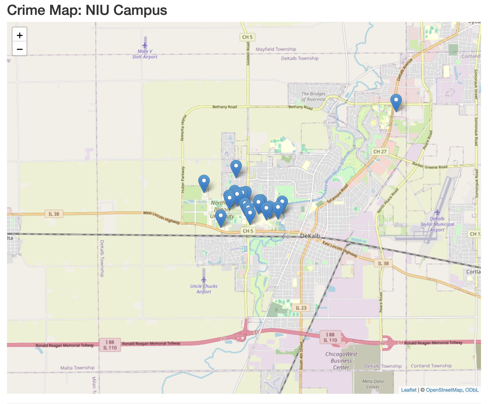
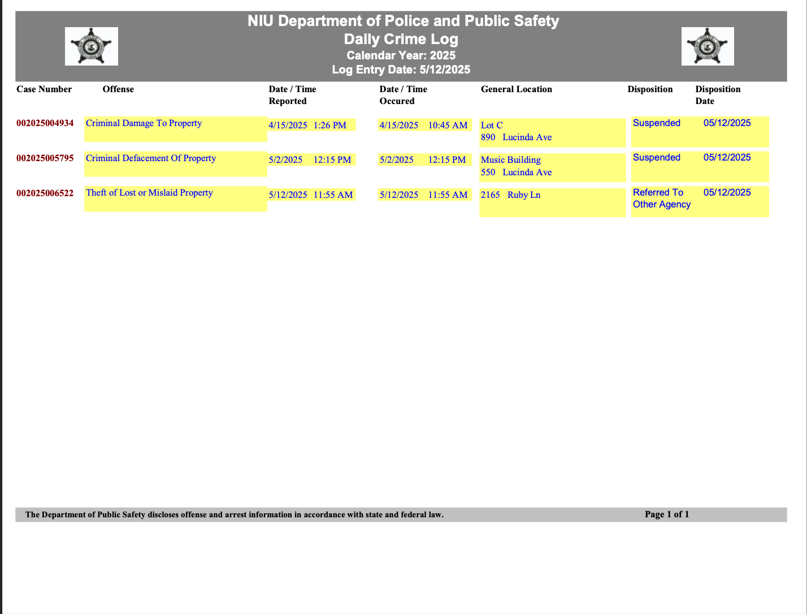
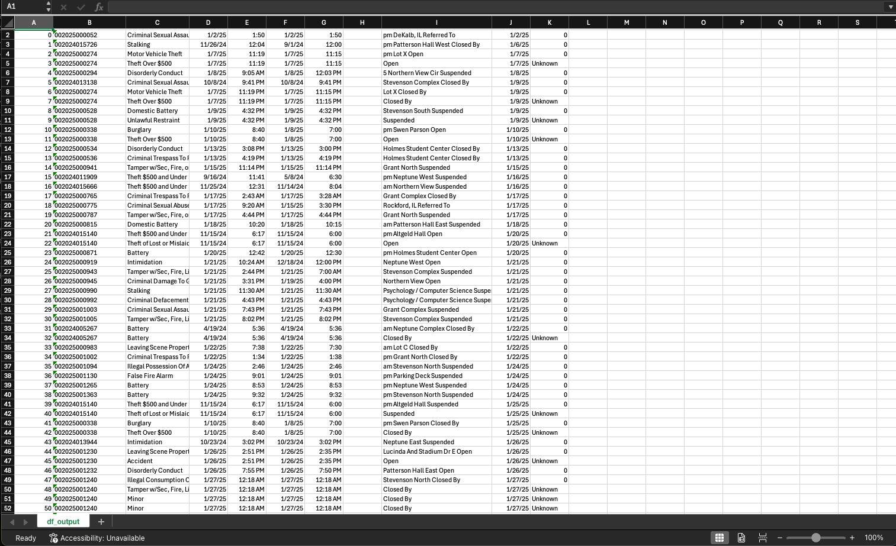

For this project, I wanted to visualize crime happening on campus for the student newspaper at NIU. This increased traffic, user engagement and stickiness for the website.

[Demo](https://devinoommen.shinyapps.io/NIU_Crime_Map/)  




The NIU police department releases a daily crime log in PDF format.

[Download/view the report](20250512_Offense.pdf)





I created a Python script that downloaded the crime logs from the campus police website. 


```python
import requests

saved_dates = []
full_date = []

def download_pdf(url, save_path):
    try:
        response = requests.get(url)
        response.raise_for_status()  # This will raise an exception if there is an HTTP error

        with open(save_path, 'wb') as f:
            f.write(response.content)

        print(f"PDF saved to {save_path}")

    except requests.exceptions.HTTPError as e:
        # Handle specific HTTP errors or generic ones
        if e.response.status_code == 404:
            print("Error 404: The PDF was not found at the URL provided.")
        else:
            print(f"HTTP error occurred: {e}")
    except Exception as e:
        # Handle other potential errors (e.g., network issues, I/O errors)
        print(f"An error occurred: {e}")

months = ["12"]

for value in months:
    for date in range(1, 32):
        if date < 10:
            scrapedate = value + "0" + str(date)
            saved_dates.append(scrapedate)
        else:
            scrapedate = value + str(date)
            saved_dates.append(scrapedate)
print(saved_dates)

for item in saved_dates:
    date = "2024" + item
    full_date.append(date)

for item in full_date:
    pdf_url = "https://www.niu.edu/publicsafetydept/WebBlotterReports/" + item + "_Offense.pdf"
    save_path = item + ".pdf"
    download_pdf(pdf_url, save_path)

```

Next I created a script to scrape the data from the PDF's. The data did not scrape from the pdf's cleanly. Some manual data cleaning was required to ensure accuracy. 


```python
from PyPDF2 import *
import pandas
import pandas as pd
import numpy as np
import os
import csv
#from crimesprocessing import *
from crimesprocessing import *

class read_pdf:

    def __init__(self, pdf_data="Offense.pdf"):
        self.reader = PdfReader(pdf_data)
        self.num_pages = len(self.reader.pages)
        self.process = None
        self.complete_myframe = []
        self.extracted_text = None
        self.full_list = []
        self.list_to_process = []
        self.startIndex = []
        self.startWords = ["WEATHER", "TOTALS", "TYPE"]
        self.list_to_send = []
        self.folder_path = "/Users/devin/carcrashreader_app/crime_pdfs"
        self.pdf_paths = []


    def updateProcess(self, process):
        """Sets the self.process variable to the list pass through parameter"""
        self.process = process
        self.con = True


    def pdf_read(self):
        """Reads a pdf file"""
        start_index = []
        # Iterates through each page in the pdf
        for page_num in range(0, self.num_pages):

            # Stores text extracted from the file to the page variable
            page = (self.reader.pages[page_num]).extract_text(Tj_sep=" ", TJ_sep="\n")


            # Splits the text from the page variable into a group of lists and stores it in the extracted_text variable
            self.extracted_text = page.split()

            # for every page, extract the text
            for num in range(0, len(self.extracted_text)):
                self.full_list.append(self.extracted_text[num])
            print(f"this is full list {self.full_list}")

        # Find the indexes that the lines should start
        for item in range(0, len(self.full_list)):
            if len(self.full_list[item]) == 12 or len(self.full_list[item]) == 13 and str(
                    self.full_list[item]).isnumeric():
                start_index.append(item)

        for item2 in range(0, len(start_index)):
            if item2 < len(start_index) - 1:
                process = self.full_list[start_index[item2]: start_index[item2 + 1]]
                for num1 in range(0, len(process)):
                    self.list_to_send.append(process[num1])
            if item2 == len(start_index) - 1:
                process = self.full_list[start_index[item2]:]
                for num1 in range(0, len(process)):
                    self.list_to_send.append(process[num1])


                #process_pdf(file_path)  # Call your function to process the PDF


class PDFManager:
    def __init__(self, folder_path):
        self.folder_path = folder_path
        self.pdf_paths = []

    def iterate_pdfs(self):
        # Iterate through all files in the given folder
        for filename in os.listdir(self.folder_path):
            if filename.lower().endswith('.pdf'):  # Check if the file is a PDF
                file_path = os.path.join(self.folder_path, filename)  # Get full path of the file
                self.pdf_paths.append(file_path)
        return self.pdf_paths


def main(folder_path):
    p = ProcessGrades()
    pdf_manager = PDFManager(folder_path)
    collect_paths = pdf_manager.iterate_pdfs()
    collect_paths.sort()

    for item in collect_paths:

    # Instantiate read pdf object and pass the transcript
        r = read_pdf(item)
    # Call the pdf read function with r object
        r.pdf_read()
        p.process_classes(r.list_to_send)
    # Output the accumulated text
    print(p.complete_myframe)
    file_path = 'output.csv'

    with open(file_path, mode='w', newline='') as file:
        writer = csv.writer(file)
        for item in p.complete_myframe:
            writer.writerow([item])

if __name__ == '__main__':

    folder_path = "/Users/devin/carcrashreader_app/12_24_crimes"
    main(folder_path)


```




Finally, I created an R shiny app that visualized the crimes by the locations listed on the crime logs. To do this I used the google maps API and plotted crimes to a map using leaflet.


```python
import pandas as pd
from geopy.geocoders import GoogleV3
from geopy.extra.rate_limiter import RateLimiter

# Read data from CSV
df = pd.read_csv('/Users/devin/NIU_CrimeLogReader/final_crimelogcsv_1_25_cleaned.csv')  # Replace with your CSV file name

API_KEY = 

# Hardcoded addresses for known places
hardcoded_addresses = {
    'DeKalb Public Library': '309 Oak St, DeKalb, IL 60115, USA',
    'NIU Campus': '1425 W Lincoln Hwy, DeKalb, IL 60115, USA',
    'Lot P': '455 Stadium Dr W, DeKalb, IL 60115, USA',
    'Health, Wellness, & Literacy Center ': '3100 Sycamore Rd, DeKalb, IL 60115, USA',
    'Patterson Hall East': '501 N Annie Glidden Rd, DeKalb, IL 60115, USA',
    'Lot 3': '300 Gilbert Dr, DeKalb, IL 60115, USA',
    'Lot S': '212 N Annie Glidden Rd, DeKalb, IL 60115, USA',
    'Recreation Center': '325 N Annie Glidden Rd, DeKalb, IL 60115, USA',
    'Music Building': '550 Lucinda Ave, DeKalb, IL 60115, USA',
    'Culvers': '1200 Dekalb Ave, DeKalb, IL 60115, USA',
    'Neptune North': '750 Lucinda Ave, DeKalb, IL 60115, USA',
    'Lot 5': '532 Newman Ln, DeKalb, IL 60115, USA',
    'Human Resources': '1515 W Lincoln Hwy, DeKalb, IL 60115, USA',
    'Grant Complex': '1250 Grant Dr N, DeKalb, IL 60115, USA',
    'Stevenson South': '420 Stadium Dr W, DeKalb, IL 60115, USA',
    'Grant North': '1250 Grant Dr N, DeKalb, IL 60115, USA',
    'Lot D': '830 Lucinda Ave, DeKalb, IL 60115, USA',
    'Stevenson Complex': '1350 Stevenson Dr N, DeKalb, IL 60115, USA',
    'Patternson Hall West': '1175 Lincoln Dr N, DeKalb, IL 60115, USA',
    'Swen Parson': '230 Normal Rd, DeKalb, IL 60115, USA',
    'Neptune West': '800 Lucinda Ave, DeKalb, IL 60115, USA',
    'Altgeld Hall': '595 College Ave, DeKalb, IL 60115, USA',
    'Lot X': '615 N Annie Glidden Rd, DeKalb, IL 60115, USA',
    'Stevenson  North': '1350 Stevenson Dr N, DeKalb, IL 60115, USA',
    'Parking Deck': '175 Normal Rd, DeKalb, IL 60115, USA',
    'Neptune Complex': '770 Lucinda Ave, DeKalb, IL 60115, USA',
    'Psychology / Computer Science': '100 Normal Rd, DeKalb, IL 60115, USA',
    'Stevenson North': '1350 Stevenson Dr N, DeKalb, IL 60115, USA',
    'Northern View': '1 Northern View Circle, DeKalb, IL 60115, USA',
    'Lot C': '890 Lucinda Avenue, DeKalb, IL 60115, USA',
    'Gilbert Hall': '383 Gilbert Drive, DeKalb, IL 60115, USA'

}

# Initialize Google geocoder
geolocator = GoogleV3(api_key=API_KEY)
geocode = RateLimiter(geolocator.geocode, min_delay_seconds=1)


# Function to get address, latitude, and longitude
def get_address_and_coords(place):
    if place in hardcoded_addresses:
        address = hardcoded_addresses[place]
        location = geocode(address)
    else:
        location = geocode(place)
        address = location.address if location else "Address not found"

    if location:
        latitude = location.latitude
        longitude = location.longitude
    else:
        latitude, longitude = None, None

    return pd.Series([address, latitude, longitude])


# Apply function to get full address, latitude, and longitude
df[['Full_Address', 'Latitude', 'Longitude']] = df['Current_Column'].apply(get_address_and_coords)

# Save the updated data to a new CSV file
df.to_csv('updated_crime_data_google_with_coords_1_25.csv', index=False)
print("Data with latitude and longitude saved to 'updated_crime_data_google_with_coords_1_25.csv'")

```


```python
library(shiny)
library(leaflet)
library(readr)
library(dplyr)
library(lubridate)

# Load the data
data <- read_csv("updated_crime_data_google_with_coords_combined.csv")  # Replace with your CSV file path

data <- data %>%
  mutate(Offense_date = as.Date(`Date Occurred`, format = "%m/%d/%y"))

data <- data %>%
  filter(Offense_date >= as.Date("2024-12-01"))

available_months <- unique(format(data$Offense_date, "%B"))
available_years <- unique(year(data$Offense_date))

# Group data by address and summarize offenses
grouped_data <- data %>%
  group_by(Full_Address, Latitude, Longitude) %>%
  summarize(
    Current_Column = first(Current_Column),  # Keep the first place name
    OffenseDates = paste("<li>", Offense, "(", Offense_date, ")", "</li>", collapse = ""),# Combine offenses as an HTML list
    .groups = "drop"
  )

# UI (User Interface)
ui <- fluidPage(
  titlePanel("Crime Map: NIU Campus"),
  leafletOutput("crimeMap", height = 800),  # Display the map
  hr(),
  fluidRow(
    column(4,
           selectInput("offenseType", "Filter by Offense:", 
                       choices = c("All", unique(data$Offense)), 
                       selected = "All"),
           uiOutput("monthDropdown"),
           uiOutput("yearDropdown")
           )
  )
)

# Server (Logic)
server <- function(input, output, session) {
  filteredData <- reactive({
    filtered <- data 
    #Filter by offense type 
    
    filtered <- filtered %>% filter(Offense_date >= as.Date("2024-12-01"))
    
    if (input$offenseType != "All") {
      filtered <- filtered %>% filter(Offense == input$offenseType)
    }
    # Filter by month
    if (!is.null(input$monthFilter) && input$monthFilter != "All") {
      filtered <- filtered %>% filter(format(Offense_date, "%B") == input$monthFilter)
    }
    # Filter by year
    if (!is.null(input$yearFilter) && input$yearFilter != "All") {
      filtered <- filtered %>% filter(year(Offense_date) == as.numeric(input$yearFilter))
    }
    # Group data by offense and summarize offenses 
    filtered %>%
      group_by(Full_Address, Latitude, Longitude) %>%
      summarize(
        Current_Column = first(Current_Column),
        OffenseDates = paste0("<li><span style='white-space: nowrap;'>", Offense, " (", Offense_date, ")</span></li>", collapse = ""),
        .groups = "drop"
      )
    
  })
  
  #Dynamically generate the month dropdown based on the filtered data
  output$monthDropdown <- renderUI({
    available_months <- unique(format(data$Offense_date, "%B"))
    selectInput("monthFilter", "Filter by Month:",
                choices = c("All", available_months),
                selected = "All")
  })
  
  # Dynamically generate the year dropwdown based on filtered date 
  output$yearDropdown <- renderUI({
    available_years <- unique(year(data$Offense_date))
    selectInput("yearFilter", "Filter by Year:",
                choices = c("All", available_years),
                selected = "All")
  })
  
  
  output$crimeMap <- renderLeaflet({
    leaflet(data) %>%
      addTiles() %>%
      setView(
        lng = mean(data$Longitude, na.rm = TRUE),  # Center the map on the average longitude
        lat = mean(data$Latitude, na.rm = TRUE),   # Center the map on the average latitude
        zoom = 13  # Adjust the zoom level
      ) %>%
      addMarkers(
        ~Longitude, ~Latitude,
        popup = ~paste(
          "<b>Place:</b>", Current_Column, "<br>",
          "<b>Address:</b>", Full_Address, "<br>",
          "<b>Offense:</b><ul>", Offense, "</ul>"  # Display all offenses as a list
        ),
        popupOptions = popupOptions(maxWidth = 500, minWidth = 300)
      )
  })
  
  observe({
    leafletProxy("crimeMap", data = filteredData()) %>%
      clearMarkers() %>%
      addMarkers(
        ~Longitude, ~Latitude,
        popup = ~paste(
          "<b>Place:</b>", Current_Column, "<br>",
          "<b>Address:</b>", Full_Address, "<br>",
          "<b>Offenses and Date Occurred:</b><ul>", OffenseDates, "</ul>"
        ),
        popupOptions = popupOptions(maxWidth = 500, minWidth = 300)
      )
  })
}

# Run the Shiny app
shinyApp(ui, server)

```
