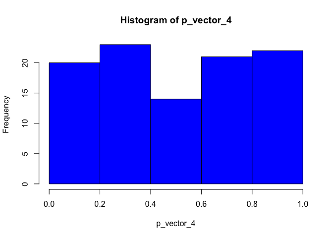

# Final Project

``` r
library(tidyverse)
```

``` r
simCorn <- function(overallEffect=0, fertilizerEffect=c(0,0,0), rowEffect=c(0,0,0), colEffect=c(0,0,0),
                    seed=NULL, dist = rnorm, ...) {
  
  
  if ((!is.numeric(seed)) && (!is.null(seed))) 
    stop("You did not enter a valid seed")
  
  n <- length(fertilizerEffect)^2

    set.seed(seed)
    error <- dist(n, ...)
    
    Fertilizer = factor(c("A", "B", "C", "C", "A", "B", "B", "C", "A"))
    Row = factor(c(1, 1, 1, 2, 2, 2, 3, 3, 3))
    Column = factor(c(1, 2, 3, 1, 2, 3, 1, 2, 3))
    Yield = overallEffect + fertilizerEffect + rowEffect + colEffect + error
    x <- data.frame(Fertilizer, Row, Column, Yield)
  
  return (x)
}
```

``` r
simCorn()
```

      Fertilizer Row Column      Yield
    1          A   1      1 -0.9121147
    2          B   1      2 -0.8740475
    3          C   1      3  1.4210789
    4          C   2      1 -0.9134040
    5          A   2      2  1.7384058
    6          B   2      3  1.4986609
    7          B   3      1  0.8706560
    8          C   3      2  0.4089045
    9          A   3      3 -1.1744278

``` r
simCorn(overallEffect=10,seed=2123,dist=rgamma,shape=2)
```

      Fertilizer Row Column    Yield
    1          A   1      1 14.83727
    2          B   1      2 10.45424
    3          C   1      3 13.13900
    4          C   2      1 10.47095
    5          A   2      2 10.90779
    6          B   2      3 13.44940
    7          B   3      1 10.77832
    8          C   3      2 11.49251
    9          A   3      3 10.62710

``` r
mu <- 7
alpha <- c(1,2,3)
beta <- c(2,2,1)
gamma <- c(3,3,2)
y <- simCorn(overallEffect=mu, fertilizerEffect=alpha, rowEffect=beta, colEffect=gamma,
             seed=29429, rnorm, mean=3, sd=2)
y
```

      Fertilizer Row Column    Yield
    1          A   1      1 19.97551
    2          B   1      2 16.08501
    3          C   1      3 16.82301
    4          C   2      1 13.00537
    5          A   2      2 16.31535
    6          B   2      3 13.89126
    7          B   3      1 15.24435
    8          C   3      2 16.98722
    9          A   3      3 19.10382

``` r
pValue <- numeric(100)
p_vector_1 <- vector(mode = "numeric", length = 100)
set.seed(1331)
for (k in 1:100) { 
  
  y <- simCorn(overallEffect=10, dist=rnorm)
  fitCorn <- lm(Yield ~ Fertilizer + Row + Column, data=y)
  pValue[k] <- anova(fitCorn)$"Pr(>F)"[1]
  p_vector_1[k] <- pValue[k]

}


p_vector_2 <- vector(mode = "numeric", length = 100)
set.seed(18694)


for (k in 1:100) { 
  
  y <- simCorn(overallEffect=10, c(1,2,3), c(0,0,1), c(0,0,1), dist=rnorm)
  fitCorn <- lm(Yield ~ Fertilizer + Row + Column, data=y)
  pValue[k] <- anova(fitCorn)$"Pr(>F)"[1]
  p_vector_2[k] <- pValue[k]
  
}


p_vector_3 <- vector(mode = "numeric", length = 100)
set.seed(6516)

for (k in 1:100) { 
  
  y <- simCorn(overallEffect=10, c(1,2,3), c(1,0,1), c(0,1,1), dist=rnorm)
  fitCorn <- lm(Yield ~ Fertilizer + Row + Column, data=y)
  pValue[k] <- anova(fitCorn)$"Pr(>F)"[1]
  p_vector_3[k] <- pValue[k]
  
}


p_vector_4 <- vector(mode = "numeric", length = 100)
set.seed(5)

for (k in 1:100) { 
  
  y <- simCorn(overallEffect=10, c(1,2,3), c(1,0,1), c(0,1,1), dist=rnorm)
  fitCorn <- lm(Yield ~ Fertilizer + Row + Column, data=y)
  pValue[k] <- anova(fitCorn)$"Pr(>F)"[1]
  p_vector_4[k] <- pValue[k]
  
}


p_vector_5 <- vector(mode = "numeric", length = 100)
set.seed(574)
for (k in 1:100) { 
  
  y <- simCorn(overallEffect=10, c(1,2,3), c(0,0,1), c(0,0,1), dist=rexp)
  fitCorn <- lm(Yield ~ Fertilizer + Row + Column, data=y)
  pValue[k] <- anova(fitCorn)$"Pr(>F)"[1]
  p_vector_5[k] <- pValue[k]
  
}


p_vector_6 <- vector(mode = "numeric", length = 100)
set.seed(9576)

for (k in 1:100) { 
  
  y <- simCorn(overallEffect=10, c(1,2,3), c(1,0,1), c(0,1,1), dist=rexp)
  fitCorn <- lm(Yield ~ Fertilizer + Row + Column, data=y)
  pValue[k] <- anova(fitCorn)$"Pr(>F)"[1]
  p_vector_6[k] <- pValue[k]
  
}


p_vector_7 <- vector(mode = "numeric", length = 100)
set.seed(9743)


for (k in 1:100) { 
  
  y <- simCorn(overallEffect=10, c(1,2,3), c(0,1,0), c(0,1,0), dist=rexp)
  fitCorn <- lm(Yield ~ Fertilizer + Row + Column, data=y)
  pValue[k] <- anova(fitCorn)$"Pr(>F)"[1]
  p_vector_5[k] <- pValue[k]
  
}
```

``` r
hist(p_vector_1, breaks = c(0.0, 0.2, 0.4, 0.6, 0.8, 1.0), col = "blue", )
```


``` r
hist(p_vector_2, breaks = c(0.0, 0.2, 0.4, 0.6, 0.8, 1.0), col = "blue", )
```


``` r
hist(p_vector_3, breaks = c(0.0, 0.2, 0.4, 0.6, 0.8, 1.0), col = "blue", )
```


``` r
hist(p_vector_4, breaks = c(0.0, 0.2, 0.4, 0.6, 0.8, 1.0), col = "blue", )
```



``` r
hist(p_vector_5, breaks = c(0.0, 0.2, 0.4, 0.6, 0.8, 1.0), col = "blue", )
```


``` r
hist(p_vector_6, breaks = c(0.0, 0.2, 0.4, 0.6, 0.8, 1.0), col = "blue", )
```


``` r
hist(p_vector_7, breaks = c(0.0, 0.2, 0.4, 0.6, 0.8, 1.0), col = "blue", )
```


